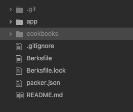

# <u>___Beats Cookbook___</u>                

<div>
  
  
</div>

<p style="font-size: 18px;">This cookbook was created to be able to automatically install:</p>

<ul>
  <li style="font-size: 18px;">Filebeat</li>
  <li style="font-size: 18px;">Metricbeat</li>
</ul>

## Contents
---
- <a href="#what" style="font-size: 20px;"> What is filebeat and metricbeat? </a>
- <a href="#how" style="font-size: 20px;"> How to use this cookbook </a>
- <a href="#tests" style="font-size: 20px;"> Run the tests </a>
---

<u><h2 id="what">What is filebeat and metricbeat?</h2></u>

<p style="font-size: 18px;">
Filebeats and Metricbeats are a part of the <a https://www.elastic.co/>elastic stack</a> Which is used to monitor immutable infrastructure.
</p>

<p style="font-size: 18px;">
Filebeats is used to send log files through the pipeline to Logstash. It determines what logs to set using its configuration file, filebeat.yml.
</p>

```yaml
#=========================== Filebeat inputs =============================
filebeat.inputs:
- type: log

  # Change to true to enable this input configuration.
  enabled: true

  # Paths that should be crawled and fetched. Glob based paths.
  paths:
    - /var/log/syslog
    - /var/log/filebeat/filebeat
    - /home/ubuntu/.bash_history
    - /var/log/mongodb/mongod.log

#----------------------------- Logstash output --------------------------------
output.logstash:
  # The Logstash hosts
  hosts: ["0.0.0.0:5046"]
```
<p style="font-size: 18px;">
Metricbeat has its own configuration as well, metricbeat.yml, which is very similar to the filebeat.yml, except you cannot choose the input. The input for metricbeat comes from system readings such as CPU usage, RAM usage, Core number etc.
</p>

<u><h2 id="how">How to use this cookbook</h2></u>

### Initial preparation
<p style="font-size: 18px;">
To use this cookbook, Follow these initial steps:
</p>

1. <p style="font-size: 16px;"> Create a Berksfile. </p>

```bash
  touch Berksfile
```

2. <p style="font-size: 16px;"> Open this Berksfile using your chosen file editor. </p>

3. <p style="font-size: 16px;"> Add these lines to the Berksfile. </p>

```ruby
source "https://supermarket.chef.io"

cookbook "beats", git: "git@github.com:RCollettSG/BeatsCookbook.git"
```

4. <p style="font-size: 16px;"> Save the Berksfile and run this line in your console under the same directory it is in. </p>

```bash
  berks vendor cookbooks
```

5. <p style="font-size: 16px;"> If done correctly, a cookbooks directory should appear in the directory you are in, containing the beats cookbook. A Berksfile.lock should also appear. </p>




### <u>Vagrant</u>
<p style="font-size: 18px;">
To use the cookbook with Vagrant, insert these lines into your Vagrantfile.
</p>

```ruby
db.vm.provision "chef_solo" do |chef|
  chef.add_recipe "beats::default"
end
```

### <u>Packer</u>
<p style="font-size: 18px;">
To use the cookbook with Packer, insert these lines into your packer.json file.
</p>

```json
"provisioners": [
    {
      "type": "chef-solo",
      "cookbook_paths": ["./cookbooks"],
      "run_list": ["beats::default"]
    }
  ]
```

<u><h2 id="tests">Run the tests</h2></u>
<p style="font-size: 18px;">
ChefSpec has been used to write the unit tests and run them effectively. It has 100% coverage of the code, so all of the methods within the recipe have a corresponding test.
</p>

<p style="font-size: 18px;">
To run these tests, use the following:
</p>

```bash
  chef exec rspec spec
```

<p style="font-size: 18px;">
Inspec has been used to write and test the integration tests. There are tests for package installs, services running and files existing to ensure maximum robustness.
</p>

<p style="font-size: 18px;">
These tests are run using the configuration written in the kitchen.yml, which is using vagrant. It is also pipeline ready, with a kitchen.cloud.yml to enable it to run on an AWS instance within a CI/CD pipeline for automation purposes.
</p>

<p style="font-size: 18px;">
To run these tests, use the following:
</p>

```bash
  kitchen test
```

---
